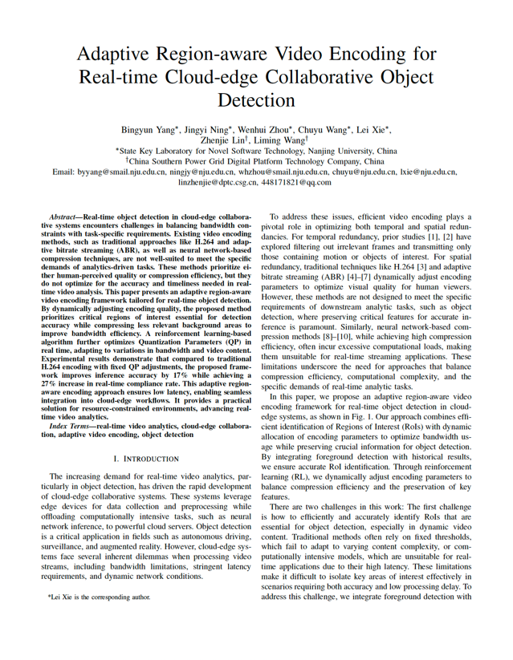

Our paper "Adaptive Region-aware Video Encoding for Real-time Cloud-edge Collaborative Object Detection" is Accepted by IEEE ICDCSW 2025!

This paper proposes CRAVE (Collaborative Region-aware Adaptive Video Encoding), which achieves efficient candidate region extraction through lightweight foreground detection and historical inference result analysis.

<!-- truncate -->

For more information, please refer to:

**Bingyun Yang, Jingyi Ning, Wenhui Zhou, Chuyu Wang, Lei Xie, Zhenjie Lin, Liming Wang. Adaptive Region-aware Video Encoding for Real-time Cloud-edge Collaborative Object Detection. Accepted to Appear In Proceeding of IEEE International Conference on Distributed Computing Systems (ICDCS 2025, poster paper).**

